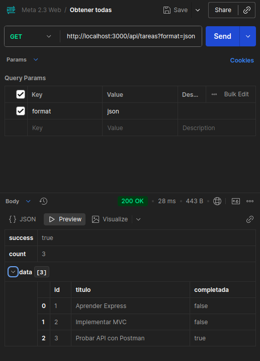
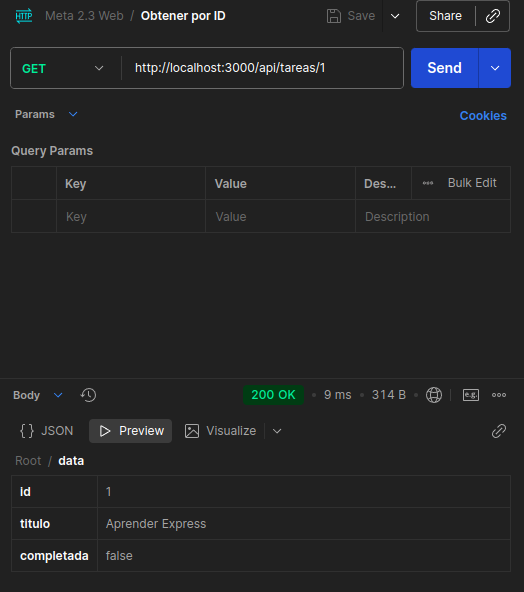
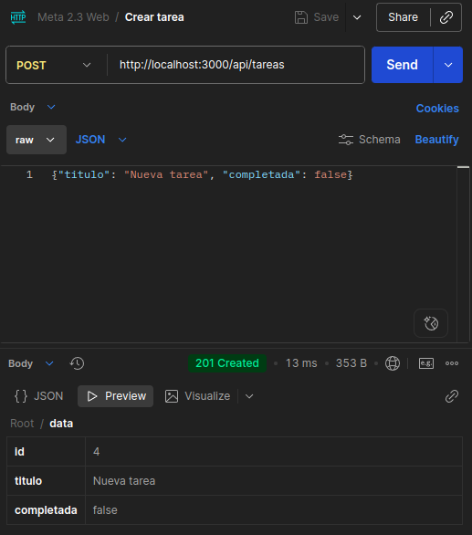
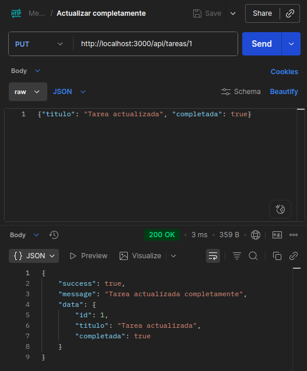
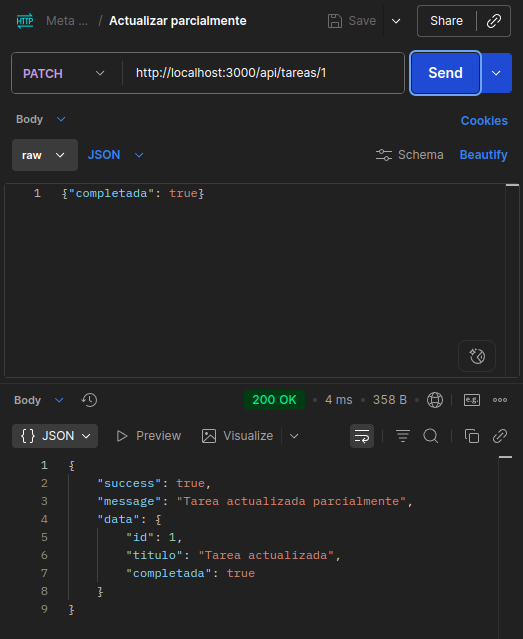
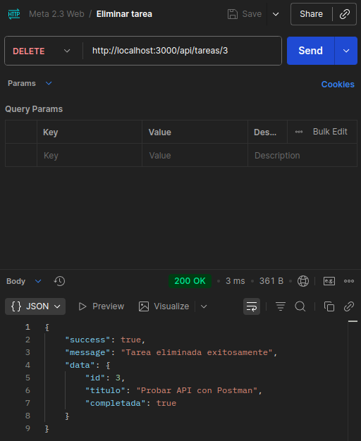
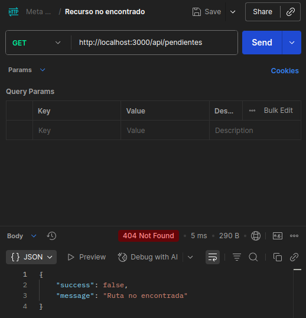
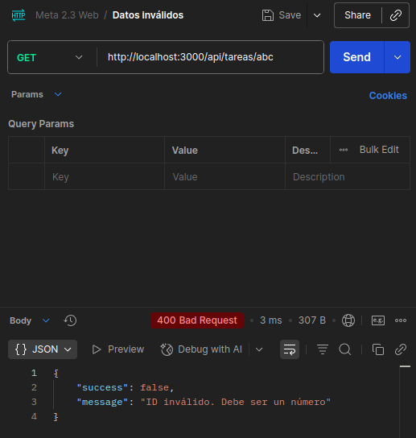
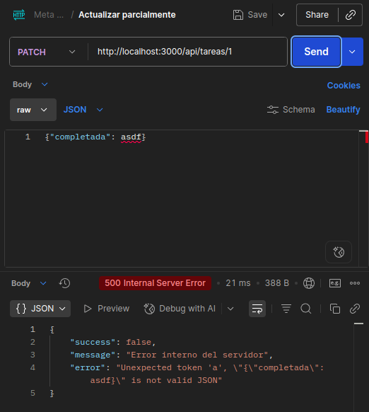

# API de Tareas - Meta 3.1

Una API REST desarrollada con **Express.js** siguiendo el patrón **MVC (Modelo-Vista-Controlador)** para gestionar tareas. Este proyecto es una práctica de desarrollo backend con Node.js.

## Descripción del Proyecto

Este proyecto implementa una API REST completa para la gestión de tareas con las siguientes características:

- CRUD completo (Crear, Leer, Actualizar, Eliminar)
- Búsqueda de tareas por título
- Actualización parcial (PATCH) y completa (PUT)
- Estructura MVC ordenada
- Middleware de logging automático
- Respuestas en formato JSON
- Manejo de errores centralizado

## Requisitos Previos

Asegúrate de tener instalado:
- **Node.js** (versión 14 o superior)
- **npm** (incluido con Node.js)

## Instalación

```bash
npm install
```

## Cómo Ejecutar

```bash
npm run dev
```

El servidor estará disponible en: **http://localhost:3000**

## Endpoints Disponibles

- `GET /api/tareas` - Obtener todas las tareas
- `GET /api/tareas/:id` - Obtener una tarea por ID
- `GET /api/tareas/buscar?q=query` - Buscar tareas por título
- `POST /api/tareas` - Crear una nueva tarea
- `PUT /api/tareas/:id` - Actualizar una tarea (completa)
- `PATCH /api/tareas/:id` - Actualizar una tarea (parcial)
- `DELETE /api/tareas/:id` - Eliminar una tarea

## Pruebas en Postman - Capturas de Pantalla

| Escenario | Código | Esperado | Captura |
|-----------|--------|----------|---------|
| GET exitoso | `GET /api/tareas` | 200 OK |  |
| GET por ID | `GET /api/tareas/:id` | 200 OK |  |
| POST exitoso | `POST /api/tareas` | 201 Created |  |
| PUT exitoso | `PUT /api/tareas/:id` | 200 OK |  |
| PATCH exitoso | `PATCH /api/tareas/:id` | 200 OK |  |
| DELETE exitoso | `DELETE /api/tareas/:id` | 200 OK |  |
| Recurso no encontrado | `GET /api/tareas/999` | 404 Not Found |  |
| Datos inválidos | `POST /api/tareas` (sin titulo) | 400 Bad Request |  |
| Error de servidor | Excepción no controlada | 500 Internal Server Error |  |
